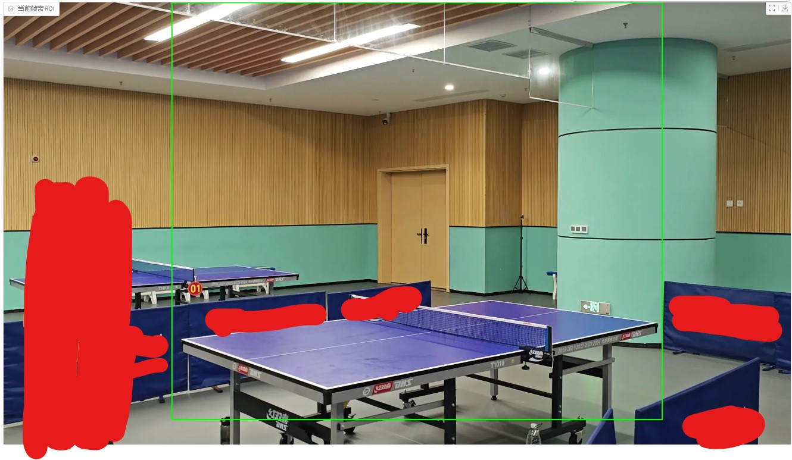

# 🏓 乒乓球比赛视频自动剪辑系统

这是一个web端的基于OpenCV的乒乓球检测与自动视频剪辑工具，可自动识别比赛中的乒乓球位置并生成精彩片段集锦。

## ✨ 功能特性
- **乒乓球实时检测**：使用OpenCV动态识别乒乓球位置
- **智能视频剪辑**：自动生成精彩片段，去除捡球的尴尬回放
- **输出自定义**：可配置输出画质、分辨率、格式等参数

## 📦 安装指南

### 系统依赖
- Python 3.10
- gradio 
- OpenCV 4.5+ (`pip install opencv-python`)

### 快速安装
```bash
git clone https://github.com/yourusername/pingpong-auto-editor-based-on-opencv.git
cd pingpong-auto-editor-based-on-opencv
pip install -r requirements.txt
```

## 📖使用教程

### 运行服务
运行项目目录下的`app.py`文件

进入"http://localhost:7860"

### 使用界面
上传一个乒乓球比赛视频(需要为固定机位)

选择其中一帧，滑动滑块框选出ROI区域，ROI区域需要包含整个球桌以及球桌上方区域

ROI的正确设置非常重要，决定了在哪个区域内检测乒乓球，正确示例：



调整好ROI之后，点击`🚀 开始处理视频`，耐心等待片刻就能得到新鲜出炉的剪辑版视频，记得下载下来哦

## 🛠️项目结构
```angular2html
.
├── app.py                # 主程序入口
├── faster_cutter.py      # 视频导出模块 
├── series_generator.py   # 切片序列生成模块
├── tmp/                  # 临时视频文件目录(自动生成)
│   └── ...               # 临时视频文件
├── requirements.txt      # 项目需求文档
└── README.md             # 项目介绍文件
```